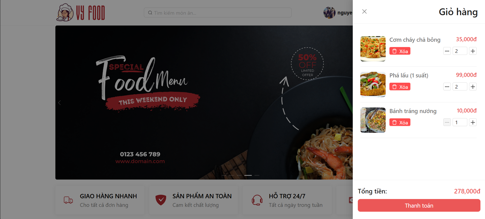
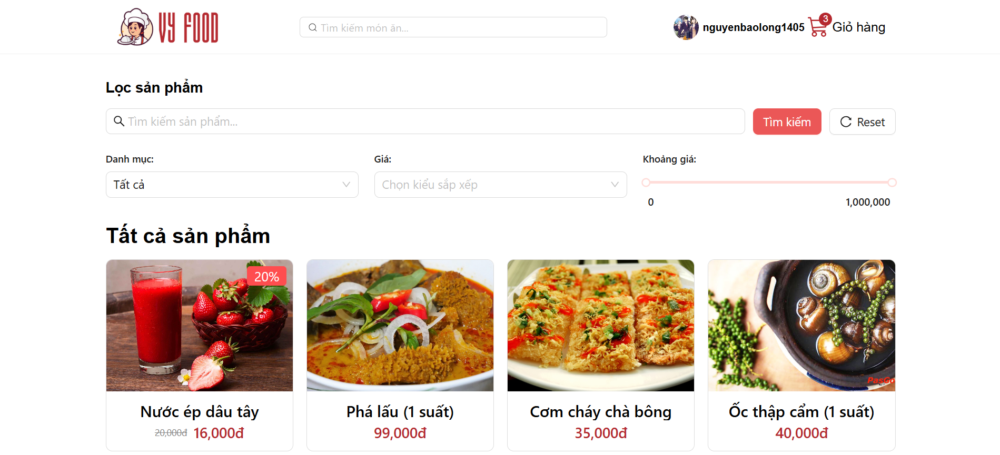
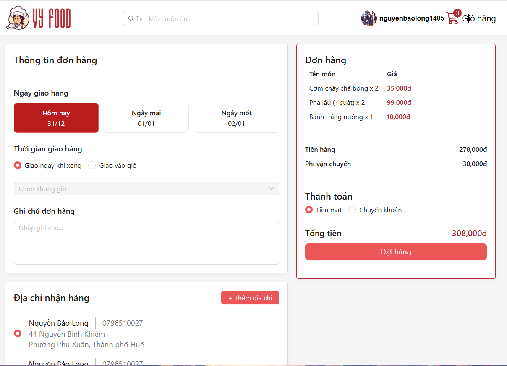
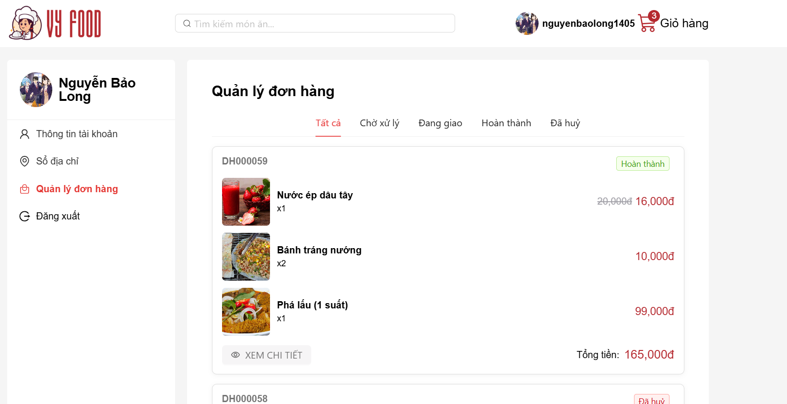
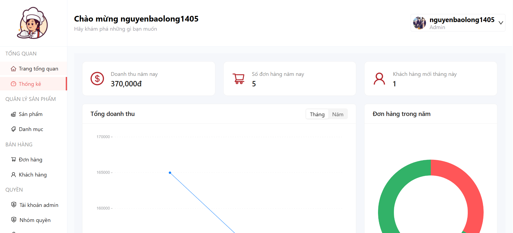
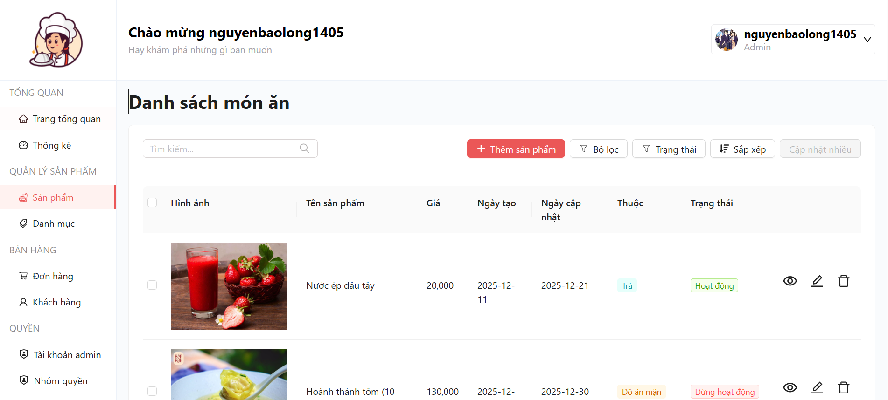
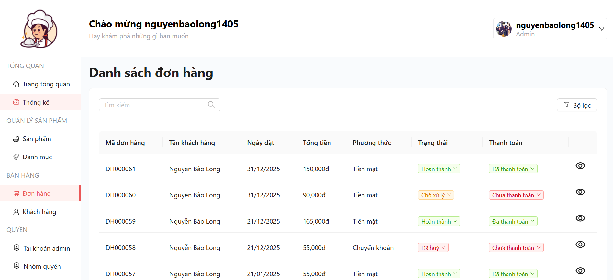
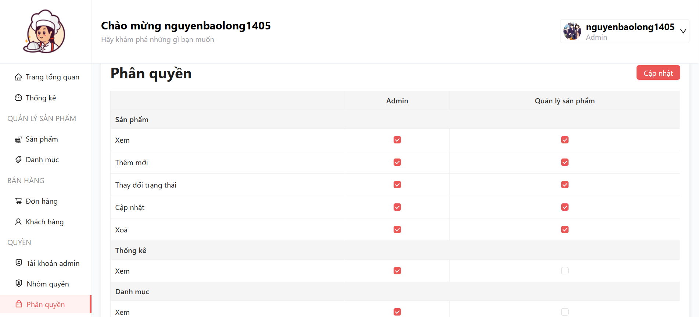

# Dự án môn lập trình web

### Hình ảnh giao diện

<h4 align="center">Trang chủ</h4>

<h4 align="center">Giỏ hàng</h4>

<h4 align="center">Tìm kiếm</h4>

<h4 align="center">Thanh toán</h4>

<h4 align="center">Các đơn đã đặt</h4>

<h4 align="center">Trang admin</h4>

<h4 align="center">Quản lý sản phẩm</h4>

<h4 align="center">Quản lý đơn hàng</h4>

<h4 align="center">Phân quyền</h4>
